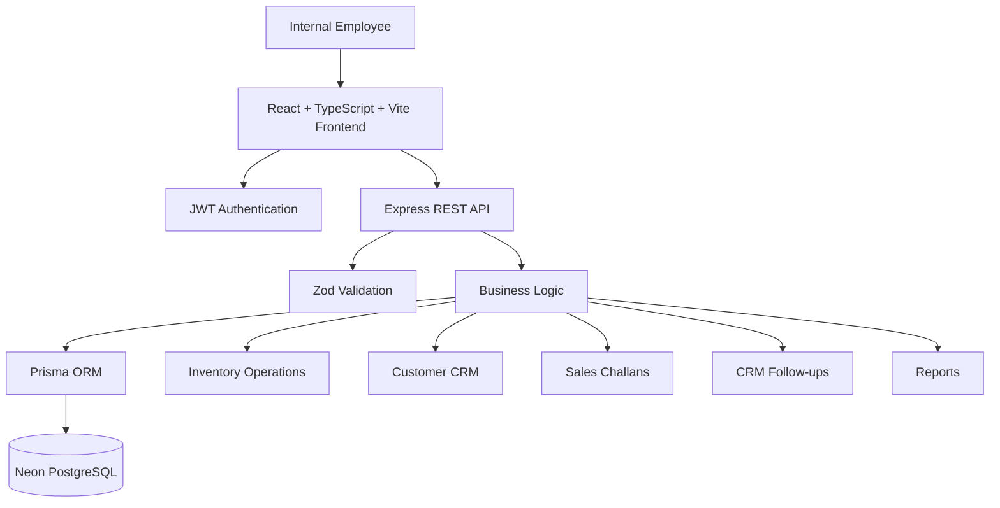

Absolutely. I checked the **case-study PDF requirement by requirement** and built the README around the company's actual submission checklist, not just a generic project README.

The case study specifically requires the GitHub repository, live frontend/backend URLs, credentials for all roles, Postman/API documentation, setup/deployment instructions, architecture explanation, assumptions, and known limitations.  It also requires the ERP/CRM modules, REST APIs, validation/error handling, deployment and environment-variable documentation.  

Below is the **submission-ready README**. I have avoided claiming features that we haven't established. The only things you need to fill in are the **Sales/Warehouse/Accounts test credentials** and, if you create one, the **Postman collection path**.

````markdown
# Mini ERP + CRM Operations Portal

A full-stack ERP + CRM operations portal developed as part of the **Full Stack Developer Case Study** for a wholesale/distribution business.

The application provides a centralized system for managing customers, products, inventory, stock movements, sales challans, CRM follow-ups, reporting, authentication, and role-based access.

The project demonstrates practical full-stack development across:

- Frontend application development
- REST API design
- PostgreSQL database design
- Authentication and authorization
- Business logic and inventory management
- Input validation and error handling
- Responsive admin-style UI
- Cloud deployment
- Environment-based configuration
- Git-based development workflow


## Table of Contents

- [Project Overview](#project-overview)
- [Business Context](#business-context)
- [Live Application](#live-application)
- [Repository](#repository)
- [Screenshots](#screenshots)
- [Core Features](#core-features)
- [Authentication and Roles](#authentication-and-roles)
- [Customer CRM Module](#customer-crm-module)
- [Product Management](#product-management)
- [Inventory Management](#inventory-management)
- [Sales Challan Module](#sales-challan-module)
- [CRM Follow-ups](#crm-follow-ups)
- [Reports and Dashboard](#reports-and-dashboard)
- [Tech Stack](#tech-stack)
- [Architecture](#architecture)
- [Architecture Diagram](#architecture-diagram)
- [Application Flow](#application-flow)
- [Database](#database)
- [API Design](#api-design)
- [API Reference](#api-reference)
- [Environment Variables](#environment-variables)
- [Local Development Setup](#local-development-setup)
- [Backend Setup](#backend-setup)
- [Frontend Setup](#frontend-setup)
- [Database Setup](#database-setup)
- [Production Deployment](#production-deployment)
- [Server Setup](#server-setup)
- [Deployment Configuration](#deployment-configuration)
- [Testing and Verification](#testing-and-verification)
- [Test Credentials](#test-credentials)
- [Postman / API Documentation](#postman--api-documentation)
- [Project Structure](#project-structure)
- [Business Rules](#business-rules)
- [Assumptions](#assumptions)
- [Known Limitations](#known-limitations)
- [Future Improvements](#future-improvements)
- [Case Study Requirement Coverage](#case-study-requirement-coverage)
- [Contributing](#contributing)
- [Author](#author)


---

# Project Overview

Mini ERP + CRM is a web-based business operations portal designed for a wholesale/distribution company.

The system provides a unified interface for internal business teams to manage:

- Customers
- Products
- Inventory
- Stock movements
- Sales challans
- Customer follow-ups
- Operational reports
- User authentication
- Role-based access

The goal of the project is to demonstrate a practical full-stack application rather than an oversized enterprise ERP system.


# Business Context

The application is designed around a wholesale/distribution business where internal employees such as:

- Sales
- Warehouse
- Accounts
- Administrators

need access to shared operational information.

The system connects customer management, product management, inventory operations, sales challans, and CRM follow-ups into a single application.

This allows the organization to maintain a consistent flow from:

```text
Customer
   ↓
Product Selection
   ↓
Sales Challan
   ↓
Inventory Update
   ↓
CRM Follow-up
   ↓
Reports
````

# Live Application

## Frontend

[https://mini-erp-crm-frontend-3e9b.onrender.com](https://mini-erp-crm-frontend-3e9b.onrender.com)

## Backend API

[https://mini-erp-crm-backend-0mnt.onrender.com](https://mini-erp-crm-backend-0mnt.onrender.com)

## GitHub Repository

[https://github.com/ManikantaPerla07/mini-erp-crm](https://github.com/ManikantaPerla07/mini-erp-crm)

## Database

PostgreSQL database hosted using Neon.

# Screenshots

Screenshots demonstrating the deployed application can be placed under:

```text
docs/screenshots/
```

Recommended screenshots:

```text
docs/screenshots/
├── dashboard.png
├── customers.png
├── products.png
├── inventory.png
├── challans.png
├── followups.png
├── reports.png
└── settings.png
```

Example:

```markdown

```

The deployed application includes screens for:

* Dashboard
* Customers
* Products
* Inventory
* Sales Challans
* Follow-ups
* Reports
* Settings

# Core Features

## Authentication

* JWT-based authentication
* Secure password hashing using bcrypt
* Protected application routes
* Role-aware access control
* Login API
* Token-based authenticated requests

## Customer CRM

* Customer creation
* Customer editing
* Customer search
* Customer information management
* Business information
* Contact information
* Customer status management
* Follow-up information
* Customer notes

## Product Management

* Product catalog
* Product name
* SKU/code
* Category
* Unit price
* Current stock
* Minimum stock level
* Warehouse/location
* Product search
* Product editing

## Inventory

* Current stock monitoring
* Stock valuation
* Minimum stock monitoring
* Low-stock identification
* Stock movement history
* IN/OUT stock movements
* Movement reason
* Created-by information
* Movement timestamp

## Sales Challans

* Create sales challans
* Customer association
* Product selection
* Quantity management
* Automatic challan number generation
* Draft and confirmed challans
* Challan history
* Challan search
* Inventory-aware sales workflow

## CRM Follow-ups

* Create follow-ups
* Customer association
* Follow-up date/time
* Notes
* Upcoming follow-ups
* Overdue follow-ups
* Follow-up status
* Follow-up management

## Reports

* Inventory reporting
* Customer reporting
* Sales challan reporting
* Inventory value
* Stock information
* Product information
* CSV export functionality

## Dashboard

The dashboard provides a high-level operational overview including:

* Total customers
* Products
* Inventory value
* Sales challans
* Inventory health
* Follow-up status

# Authentication and Roles

The application uses JWT-based authentication.

The case study defines four required roles:

| Role      | Purpose                                               |
| --------- | ----------------------------------------------------- |
| Admin     | Full system administration and operational management |
| Sales     | Customer and sales-related operations                 |
| Warehouse | Product and inventory-related operations              |
| Accounts  | Business/account-related operations                   |

Authentication flow:

```text
User
 ↓
Login Form
 ↓
POST /auth/login
 ↓
Backend validates credentials
 ↓
Password verification using bcrypt
 ↓
JWT generated
 ↓
Frontend stores authenticated session
 ↓
Protected API requests
 ↓
Role-based authorization
```

The authentication system is designed so that protected resources require a valid authenticated session.

# Customer CRM Module

The Customer CRM module manages customer information required for day-to-day business operations.

## Customer Information

Customer records support information such as:

* Customer name
* Mobile number
* Email
* Business name
* GST number
* Customer type
* Address
* Status
* Follow-up date
* Notes

## Customer Types

The system supports the business categories specified in the case study:

* Retail
* Wholesale
* Distributor

## Customer Status

Supported business statuses include:

* Lead
* Active
* Inactive

## Customer Operations

* Add customer
* Edit customer
* Search customers
* View customer information
* Add follow-up notes

# Product Management

The Product module provides product catalog management.

Each product contains information such as:

| Field         | Description                    |
| ------------- | ------------------------------ |
| Product Name  | Name of the product            |
| SKU           | Unique product/code identifier |
| Category      | Product classification         |
| Unit Price    | Current selling/unit price     |
| Current Stock | Current available quantity     |
| Minimum Stock | Threshold for stock alerts     |
| Location      | Warehouse/storage location     |

Available operations include:

* Add product
* Edit product
* Search products
* View product information
* Monitor stock levels

# Inventory Management

The Inventory module provides visibility into current stock and stock movement history.

## Inventory Monitoring

The system displays:

* Total products
* Healthy stock
* Low stock
* Inventory value
* Total units
* Product location

## Stock Movement Log

Stock movements record:

* Product
* Quantity changed
* Movement type
* Reason
* Created by
* Timestamp

Movement types:

```text
IN
OUT
```

Example:

```text
Product: HP Laptop
Movement: IN
Quantity: +20
Reason: Initial stock entry
Created By: System Administrator
```

Stock movement history provides an operational audit trail for inventory changes.

# Sales Challan Module

The Sales Challan module provides the sales transaction workflow required by the case study.

## Challan Information

A challan contains:

* Challan number
* Customer
* Products
* Quantity
* Total quantity
* Status
* Created by
* Created date

## Challan Status

The supported workflow includes:

```text
Draft
Confirmed
Cancelled
```

## Challan Workflow

```text
Create Challan
      ↓
Select Customer
      ↓
Select Products
      ↓
Specify Quantities
      ↓
Save as Draft
      ↓
Review
      ↓
Confirm
      ↓
Inventory Updated
```

## Inventory Integration

Confirmed sales transactions are connected with inventory operations.

The application is designed to prevent invalid stock operations such as reducing inventory below the available quantity.

The backend performs business validation before processing inventory-affecting operations.

# CRM Follow-ups

The Follow-ups module provides basic CRM activity management.

Each follow-up is associated with a customer and includes:

* Follow-up date/time
* Customer
* Notes
* Creator
* Status

The system identifies:

* Total follow-ups
* Today's follow-ups
* Upcoming follow-ups
* Overdue follow-ups

This provides sales users with a simple way to manage customer engagement activities.

# Reports and Dashboard

The application includes an operational dashboard and reporting area.

## Dashboard

The dashboard provides an overview of:

* Customers
* Products
* Inventory value
* Challans
* Inventory health
* Follow-up activity

## Reports

Reports provide views for:

* Inventory
* Customers
* Sales challans

The reporting interface also supports CSV export.

# Tech Stack

## Frontend

* React
* TypeScript
* Vite
* HTML
* CSS
* JavaScript/TypeScript

## Backend

* Node.js
* TypeScript
* Express.js
* REST APIs
* Prisma ORM
* Zod
* JWT
* bcrypt
* dotenv
* CORS

## Database

* PostgreSQL
* Neon PostgreSQL
* Prisma ORM

## Deployment

* Render Static Site — Frontend
* Render Web Service — Backend
* Neon — PostgreSQL Database
* GitHub — Source control

# Architecture

The application follows a three-layer architecture:

```text
┌──────────────────────────────┐
│          Frontend            │
│                              │
│ React + TypeScript + Vite    │
│ Admin-style responsive UI    │
└──────────────┬───────────────┘
               │
               │ REST API / JSON
               ▼
┌──────────────────────────────┐
│           Backend            │
│                              │
│ Node.js + Express + TS       │
│ JWT Authentication           │
│ Role Authorization           │
│ Validation + Business Logic  │
└──────────────┬───────────────┘
               │
               │ Prisma ORM
               ▼
┌──────────────────────────────┐
│         PostgreSQL           │
│                              │
│ Neon PostgreSQL Database     │
└──────────────────────────────┘
```

## Main Responsibilities

### Frontend

Responsible for:

* User interface
* Navigation
* Forms
* Data presentation
* Search/filter interfaces
* API communication
* Authentication state

### Backend

Responsible for:

* Authentication
* Authorization
* API endpoints
* Validation
* Business rules
* Inventory operations
* Database interaction
* Error handling

### Database

Responsible for:

* Persistent business data
* Users
* Customers
* Products
* Inventory
* Stock movements
* Challans
* Follow-ups

# Architecture Diagram



# Application Flow

## Authentication Flow

```text
Login
 ↓
Validate email/password
 ↓
Verify password
 ↓
Generate JWT
 ↓
Authenticated frontend session
 ↓
Protected API requests
```

## Customer Flow

```text
Add Customer
 ↓
Validate Input
 ↓
Store Customer
 ↓
Search / View / Edit
 ↓
Create Follow-up
```

## Inventory Flow

```text
Add Product
 ↓
Set Initial Stock
 ↓
Track Stock Movements
 ↓
Monitor Minimum Level
 ↓
Identify Low Stock
```

## Sales Flow

```text
Select Customer
 ↓
Select Products
 ↓
Specify Quantity
 ↓
Create Draft
 ↓
Confirm Challan
 ↓
Validate Stock
 ↓
Update Inventory
 ↓
Record Stock Movement
```

# Database

The backend uses PostgreSQL through Prisma ORM.

The database is hosted on Neon for the deployed application.

Prisma provides:

* Database schema management
* Type-safe database access
* Migration support
* Prisma Client generation
* Seed support

# API Design

The backend exposes REST APIs consumed by the React frontend.

API design principles include:

* REST-style resource endpoints
* JSON request/response format
* JWT authentication
* Role-based authorization
* Input validation
* Appropriate HTTP status codes
* Error responses
* Search/filter support where required
* Database-backed persistence

# API Reference

The following endpoints represent the application's REST API structure.

## Authentication

### POST /auth/login

Authenticates a user and returns a JWT.

Example request:

```json
{
  "email": "admin@erp.com",
  "password": "YOUR_TEST_PASSWORD"
}
```

Example response structure:

```json
{
  "success": true,
  "data": {
    "token": "JWT_TOKEN"
  }
}
```

## Customers

### GET /customers

Returns customer records.

Example:

```http
GET /api/customers
Authorization: Bearer <JWT>
```

## Products

Product APIs provide operations for:

* Listing products
* Creating products
* Updating products
* Searching products
* Retrieving inventory-related product information

## Inventory

Inventory APIs provide operations for:

* Retrieving inventory
* Recording stock movements
* Retrieving stock movement history
* Monitoring stock levels

## Challans

Challan APIs provide operations for:

* Creating challans
* Listing challans
* Viewing challans
* Updating challan status
* Processing sales-related inventory changes

## Follow-ups

Follow-up APIs provide operations for:

* Creating follow-ups
* Listing follow-ups
* Updating follow-ups
* Managing customer activity

> The complete API endpoint collection can be provided through the Postman collection/API documentation included with the submission.

# Environment Variables

Environment variables are used for environment-specific configuration and secrets.

## Backend

Create:

```text
backend/.env
```

Example:

```env
DATABASE_URL=your_neon_postgresql_connection_string
JWT_SECRET=your_secure_jwt_secret
PORT=5000
```

### DATABASE_URL

PostgreSQL connection string used by Prisma.

### JWT_SECRET

Secret used to sign and verify JWT authentication tokens.

### PORT

Backend server port.

For local development:

```env
PORT=5000
```

In production, the hosting platform provides the required runtime port configuration.

## Frontend

The frontend supports:

```env
VITE_API_URL=http://localhost:5000/api
```

For production deployment:

```env
VITE_API_URL=https://mini-erp-crm-backend-0mnt.onrender.com/api
```

Environment files containing secrets must not be committed to Git.

# Local Development Setup

## Prerequisites

Install:

* Node.js
* npm
* Git
* PostgreSQL-compatible database

A Neon PostgreSQL database can be used for development as well.

# Clone Repository

```bash
git clone https://github.com/ManikantaPerla07/mini-erp-crm.git
cd mini-erp-crm
```

# Backend Setup

```bash
cd backend
npm install
```

Create:

```text
backend/.env
```

Add:

```env
DATABASE_URL=your_database_url
JWT_SECRET=your_secure_secret
PORT=5000
```

Generate Prisma Client:

```bash
npx prisma generate
```

Run database migrations when required:

```bash
npx prisma migrate dev
```

Seed the database:

```bash
npm run prisma:seed
```

Start development server:

```bash
npm run dev
```

Backend:

```text
http://localhost:5000
```

# Backend Production Build

From:

```text
backend/
```

run:

```bash
npm run build
```

Start production server:

```bash
npm start
```

The backend server listens on the runtime port provided through:

```env
PORT
```

# Frontend Setup

Open another terminal:

```bash
cd frontend
npm install
```

Create the frontend environment file if required:

```text
frontend/.env
```

Add:

```env
VITE_API_URL=http://localhost:5000/api
```

Start development server:

```bash
npm run dev
```

Build the frontend:

```bash
npm run build
```

The production build is generated inside:

```text
frontend/dist/
```

# Database Setup

The application uses Prisma with PostgreSQL.

After configuring `DATABASE_URL`:

```bash
cd backend
npx prisma generate
```

For development database migrations:

```bash
npx prisma migrate dev
```

For production deployment, database migrations should be applied using the appropriate Prisma production workflow.

The database connection string is supplied through the `DATABASE_URL` environment variable rather than being hard-coded in application source code.

# Production Deployment

The application is deployed using free cloud infrastructure, as permitted by the case study.

## Deployment Architecture

```text
GitHub Repository
       │
       ├───────────────┐
       │               │
       ▼               ▼
Render Static Site   Render Web Service
       │               │
       │               │
   React/Vite      Node/Express API
                       │
                       │
                       ▼
                 Neon PostgreSQL
```

## Frontend

Platform:

```text
Render Static Site
```

Repository:

```text
ManikantaPerla07/mini-erp-crm
```

Branch:

```text
main
```

Root directory:

```text
frontend
```

Build command:

```bash
npm install && npm run build
```

Publish directory:

```text
frontend/dist
```

Production environment variable:

```env
VITE_API_URL=https://mini-erp-crm-backend-0mnt.onrender.com/api
```

## Backend

Platform:

```text
Render Web Service
```

Repository:

```text
ManikantaPerla07/mini-erp-crm
```

Branch:

```text
main
```

Root directory:

```text
backend
```

Build command:

```bash
npm install && npm run build
```

Start command:

```bash
npm start
```

Required environment variables:

```env
DATABASE_URL=<Neon PostgreSQL connection string>
JWT_SECRET=<secure JWT secret>
PORT=<runtime port>
```

## Database

Platform:

```text
Neon PostgreSQL
```

The production database connection is supplied to the backend through:

```env
DATABASE_URL
```

# Server Setup

The production backend is deployed as a Render Web Service.

The server process:

1. Installs Node.js dependencies.
2. Generates/builds the TypeScript application.
3. Generates the Prisma Client.
4. Starts the compiled Node.js server.
5. Listens on the runtime `PORT`.
6. Exposes the REST API through the Render service URL.

The backend production server is available at:

[https://mini-erp-crm-backend-0mnt.onrender.com](https://mini-erp-crm-backend-0mnt.onrender.com)

# Deployment Configuration

## Frontend

```text
Service Type: Static Site
Platform: Render
Branch: main
Root Directory: frontend
Build Command: npm install && npm run build
Publish Directory: dist
```

## Backend

```text
Service Type: Web Service
Platform: Render
Branch: main
Root Directory: backend
Build Command: npm install && npm run build
Start Command: npm start
```

## Database

```text
Database: PostgreSQL
Provider: Neon
```

## Source Control

The project is maintained in GitHub with incremental commits.

Latest production-preparation commit:

```text
5369657
chore: prepare application for production deployment
```

# Testing and Verification

The application was verified after deployment through the live frontend and backend.

## Backend Verification

The login API was tested against the deployed backend.

Example:

```http
POST https://mini-erp-crm-backend-0mnt.onrender.com/api/auth/login
```

The API successfully returned:

* Success status
* Authentication token

## Frontend Verification

The deployed frontend was tested against the production backend.

Verified application areas include:

* Login
* Dashboard
* Customers
* Products
* Inventory
* Challans
* Follow-ups
* Reports
* Settings

## Build Verification

Backend:

```bash
npm run build
```

Result:

```text
TypeScript compilation successful
```

Frontend:

```bash
npm run build
```

Result:

```text
Vite production build successful
```

The Vite build may report a bundle-size optimization warning for large JavaScript chunks. This does not prevent the production build from completing successfully.

# Test Credentials

The following accounts should be provided to the evaluator for testing.

> Use dedicated test accounts for submission. Do not expose personal or production credentials.

| Role      | Email                  | Password                       |
| --------- | ---------------------- | ------------------------------ |
| Admin     | `admin@erp.com`        | `YOUR_ADMIN_TEST_PASSWORD`     |
| Sales     | `YOUR_SALES_EMAIL`     | `YOUR_SALES_TEST_PASSWORD`     |
| Warehouse | `YOUR_WAREHOUSE_EMAIL` | `YOUR_WAREHOUSE_TEST_PASSWORD` |
| Accounts  | `YOUR_ACCOUNTS_EMAIL`  | `YOUR_ACCOUNTS_TEST_PASSWORD`  |

The Admin account used during deployment verification was:

```text
Email: admin@erp.com
Password: Admin@123
```

**Replace this with a dedicated submission password before publishing the repository/README if this credential is not intended to remain active.**

The case study requires test credentials for all required roles.

# Postman / API Documentation

The project should be accompanied by either a Postman collection or complete API documentation.

Recommended submission structure:

```text
docs/
└── postman/
    └── mini-erp-crm.postman_collection.json
```

The collection should cover:

### Authentication

```text
POST /api/auth/login
```

### Customers

```text
GET    /api/customers
POST   /api/customers
PUT    /api/customers/:id
GET    /api/customers/:id
```

### Products

```text
GET    /api/products
POST   /api/products
PUT    /api/products/:id
```

### Inventory

```text
GET    /api/inventory
POST   /api/inventory/movements
GET    /api/inventory/movements
```

### Challans

```text
GET    /api/challans
POST   /api/challans
GET    /api/challans/:id
```

### Follow-ups

```text
GET    /api/followups
POST   /api/followups
PUT    /api/followups/:id
```

> Endpoint names should match the final backend implementation. The Postman collection should be treated as the authoritative API testing artifact.

# Project Structure

```text
mini-erp-crm/
│
├── backend/
│   ├── prisma/
│   │   ├── schema.prisma
│   │   └── seed.ts
│   │
│   ├── src/
│   │   ├── server.ts
│   │   ├── app.ts
│   │   └── ...
│   │
│   ├── package.json
│   ├── tsconfig.json
│   └── .env
│
├── frontend/
│   ├── src/
│   │   ├── pages/
│   │   │   ├── Customers.tsx
│   │   │   ├── Followups.tsx
│   │   │   └── ...
│   │   │
│   │   ├── services/
│   │   │   └── api.ts
│   │   │
│   │   ├── Challans.tsx
│   │   └── ...
│   │
│   ├── package.json
│   ├── vite.config.*
│   └── ...
│
├── docs/
│   ├── screenshots/
│   └── postman/
│
├── .gitignore
└── README.md
```

# Business Rules

The application follows the core business flow defined by the case study.

## Authentication

* Users must authenticate before accessing protected application functionality.
* Authentication uses JWT.
* Passwords are not stored as plaintext.

## Inventory

* Inventory movements are tracked.
* IN and OUT movements are distinguished.
* Stock levels are monitored against minimum stock thresholds.

## Sales Challans

* Challans can be created as drafts.
* Confirmed sales transactions affect inventory.
* Inventory validation is performed before stock-reducing operations.
* Stock should not become negative.
* Insufficient stock should result in an appropriate API error.
* Challans preserve transaction information required for historical records.

# Assumptions

The following assumptions were made while implementing the case study:

1. The application is intended for internal business employees rather than public customers.
2. Authentication is handled through JWT-based sessions.
3. PostgreSQL is used as the primary relational database.
4. Prisma is used as the database access layer.
5. Customer, product, inventory, challan, and follow-up data are persisted in the database.
6. Inventory is managed through stock quantities and stock movement records.
7. A sales challan represents a business transaction and can affect inventory when confirmed.
8. The project focuses on the core workflows requested in the case study rather than attempting to implement a complete enterprise ERP suite.
9. Cloud deployment uses free-tier services because the case study explicitly permits free hosting and states that candidates are not expected to spend money.

# Known Limitations

The current version intentionally focuses on the scope of the case study.

Known limitations include:

* It is not a complete enterprise accounting/ERP platform.
* Advanced accounting integrations are outside the current scope.
* GST filing/integration is outside the current scope.
* Payment gateway integration is outside the current scope.
* Multi-company/tenant management is outside the current scope.
* Advanced warehouse management is outside the current scope.
* Advanced analytics and business intelligence are limited to the reporting functionality currently implemented.
* Free-tier cloud instances may experience cold-start delays after periods of inactivity.
* The frontend production bundle currently produces a Vite chunk-size warning; the build and deployment still complete successfully.
* Advanced production observability and enterprise-scale infrastructure are outside the scope of this case study.

# Future Improvements

Potential future enhancements include:

* Advanced role-specific dashboards
* More granular permissions
* Advanced inventory analytics
* Purchase order management
* Invoice generation
* PDF invoice/challan export
* GST-aware invoice generation
* Advanced customer history
* Advanced reporting and analytics
* Pagination for large datasets
* Advanced search and filtering
* Product image uploads
* AWS S3 integration
* Docker-based deployment
* GitHub Actions CI/CD
* Automated testing
* Improved frontend code splitting
* Production monitoring and observability

# Case Study Requirement Coverage

The implementation is designed around the requirements specified in the Full Stack Developer Case Study.

| Case Study Requirement     | Implementation           |
| -------------------------- | ------------------------ |
| Node.js                    | Yes                      |
| TypeScript                 | Yes                      |
| Express.js                 | Yes                      |
| PostgreSQL                 | Yes                      |
| REST APIs                  | Yes                      |
| Input validation           | Yes                      |
| Error handling             | Yes                      |
| React                      | Yes                      |
| HTML/CSS                   | Yes                      |
| JavaScript/TypeScript      | Yes                      |
| Responsive admin UI        | Yes                      |
| Environment variables      | Yes                      |
| GitHub repository          | Yes                      |
| README documentation       | Yes                      |
| Authentication             | JWT-based                |
| Admin role                 | Yes                      |
| Sales role                 | Yes                      |
| Warehouse role             | Yes                      |
| Accounts role              | Yes                      |
| Customer CRM               | Yes                      |
| Product management         | Yes                      |
| Inventory management       | Yes                      |
| Stock movement tracking    | Yes                      |
| Sales challans             | Yes                      |
| CRM follow-ups             | Yes                      |
| Dashboard                  | Yes                      |
| Reports                    | Yes                      |
| Cloud deployment           | Render + Neon            |
| Live frontend              | Yes                      |
| Live backend               | Yes                      |
| Database deployment        | Neon PostgreSQL          |
| API documentation          | README/API documentation |
| Architecture documentation | Yes                      |
| Assumptions                | Documented               |
| Known limitations          | Documented               |

The case study also lists Docker setup, GitHub Actions deployment, PDF invoice export, and AWS S3 product-image upload as bonus features rather than mandatory requirements.

# Deployment URLs

### Frontend

[https://mini-erp-crm-frontend-3e9b.onrender.com](https://mini-erp-crm-frontend-3e9b.onrender.com)

### Backend

[https://mini-erp-crm-backend-0mnt.onrender.com](https://mini-erp-crm-backend-0mnt.onrender.com)

### GitHub

[https://github.com/ManikantaPerla07/mini-erp-crm](https://github.com/ManikantaPerla07/mini-erp-crm)

# Submission Checklist

Before submitting the case study, verify that the following items are included:

* [x] GitHub repository
* [x] Live frontend URL
* [x] Live backend API URL
* [x] PostgreSQL database
* [x] Authentication
* [x] Role-based access
* [x] Customer CRM
* [x] Product management
* [x] Inventory management
* [x] Stock movement tracking
* [x] Sales challans
* [x] CRM follow-ups
* [x] Dashboard
* [x] Reports
* [x] REST API
* [x] Environment variable documentation
* [x] Local setup instructions
* [x] Deployment instructions
* [x] Architecture explanation
* [x] Assumptions
* [x] Known limitations
* [ ] Test credentials for all four roles
* [ ] Final Postman collection/API documentation artifact
* [ ] Final screenshots in `docs/screenshots/`

# Contributing

This repository was developed as a case-study project.

For future contributions:

1. Create a feature branch.
2. Make focused changes.
3. Test the affected functionality.
4. Use clear commit messages.
5. Verify both frontend and backend builds.
6. Open a pull request with a description of the changes.

# Author

**Manikanta Perla**

B.Tech Computer Science & Engineering

# License

This project was developed as part of a Full Stack Developer case-study submission.

Unless otherwise specified by the repository owner, the project should be treated as a case-study/portfolio project and not as a production ERP product for commercial redistribution.

```

### One important correction before you paste this

There are **3 things I deliberately left as items you must finish**, because the PDF explicitly asks for them and I don't want your README to falsely claim they exist:

1. **Four test accounts**
   - Admin
   - Sales
   - Warehouse
   - Accounts

2. **Postman collection**
   - Ideally put the JSON file inside `docs/postman/`.

3. **Screenshots**
   - Put the screenshots you already captured into `docs/screenshots/`.

The PDF explicitly requires **test login credentials for all roles** and **a Postman collection or API documentation**, alongside the live URLs and README. :contentReference[oaicite:3]{index=3}

Also, **do not publish `Admin@123` as a permanent credential** if that is currently an active account. Create dedicated submission/test accounts or change the password before making the repository/README public.

This README now covers the company's requested **technical stack, required modules, API expectations, deployment, environment variables, server setup, local setup, architecture, assumptions, limitations, live links, credentials section, and API/Postman documentation section**. :contentReference[oaicite:4]{index=4} :contentReference[oaicite:5]{index=5}
```
